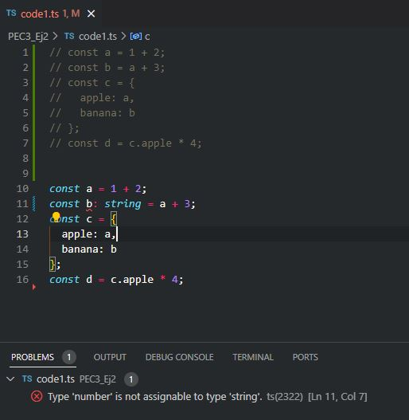

/***Modifica el codi per aconseguir que aparegui una línia vermella d'error a l'IDE avisant-te que s'està disparant un TypeError. Pren una captura de pantalla del teu resultat i fes que es mostri dins del fitxer PEC3_Ej2_respuestas_teoria.md (0.5 punts). Dins aquest mateix document explica per què s'ha produït això i quins avantatges té.***/

S'ha forçat que la constant b sigui de tipus string i s'hi està intentant assignar un nombre.
TypeScript, al ser més restrictiu, no permet barrejes de strings amb nombres, com ho podria arribar a fer JavaScript.

/***Per a cadascun dels valors del fitxer code2.ts, quin tipus de dades inferirà TypeScript? Expliqueu per què s'ha inferit aquest tipus de dades.***/

const a = 1042;
Tipus Inferit: number
TypeScript veu que s'ha assignat un valor numèric literal a la variable a i, per tant, infereix que a és de tipus number.

const b = 'apples and oranges';
Tipus Inferit: string
El valor assignat a la variable b està entre cometes simples, indicant que és una cadena de caràcters, així que TypeScript infereix que b és de tipus string.

const c = 'pineapples';
Tipus Inferit: string
Igual que la constant b, el valor entre cometes simples implica que c és una cadena de caràcters.

const d = [true, true, false];
Tipus Inferit: boolean[]
El valor assignat a la constant d és un array que conté únicament valors booleans, per tant TypeScript infereix que d és un array de booleans (boolean[]).

const e = { type: 'ficus' };
Tipus Inferit: { type: string }
TypeScript infereix que la constant e és un objecte amb una propietat type que és de tipus string.

const f = [1, false];
Tipus Inferit: (number | boolean)[]
Com que l'array conté tant un number com un boolean, TypeScript infereix un tipus d'unió per als elements de l'array, indicant que cada element pot ser o bé un number o bé un boolean.

const g = [3];
Tipus Inferit: number[]
L'array g conté un sol element numèric, per tant TypeScript infereix que g és un array de nombres.

const h = null;
Tipus Inferit: any o null depenent de la configuració del compilador de TypeScript
En versions més antigues de TypeScript o amb certes configuracions (strictNullChecks desactivat), h podria ser inferit com any, que és un tipus que pot ser assignat qualsevol valor. Amb strictNullChecks activat el tipus de h seria null, ja que s'ha assignat explícitament el valor null.

/***Per què es dispara cadascun dels errors del fitxer code3.ts?***/

const i: 3 = 3;
i = 4; // Error TS2588 : Cannot assign to 'i' because it is a constant.ts(2588)
La constant i està declarada amb un tipus literal 3, cosa que significa que només pot contenir el valor 3. Amb TypeScript, les constants no poden ser reassignades després de la seva inicialització. 

const j = [1, 2, 3];
j.push(4);
j.push('5'); // Error TS2345: Argument of type '"5"' is not assignable to parameter of type 'number'.
Quan es declara un array amb valors numèrics com [1, 2, 3], TypeScript infereix el tipus de l'array un array de nombres. El mètode push només permet afegir elements que siguin del mateix tipus que els elements de l'array. Intentar afegir un string '5' a un array numèric és un error tipus, ja que '5' no és assignable al tipus number.

let k: never = 4; // Error TSTS2322: Type '4' is not assignable to type 'never'.
Never és un tipus que representa valors que mai poden ocórrer. Per exemple, una funció que llança una excepció o una que entra en un bucle infinit pot ser tipada com never perquè no retorna cap valor. Assignar 4 a una variable de tipus never significa que k no hauria de tenir mai cap valor assignable. Això és un error de tipus perquè s'està intentant assignar un valor a una variable que ha estat designada per no tenir-ne cap.

let l: unknown = 4;
let m = l * 2; // Error TS2571: Object is of type 'unknown'.
El tipus unknown és un tipus que pot contenir qualsevol valor, però no es pot operar amb ell sense una comprovació de tipus o una asserció de tipus prèvia. En aquest cas, s'està intentant realitzar una operació sobre una variable l de tipus unknown sense assegurar-se primer de que l és de tipus number. TypeScript evita aquesta operació perquè podria ser perillosa; l podria ser qualsevol cosa.

/***Quina és la diferència entre una classe i una interfície a TypeScript?***/

A TypeScript, les interfícies s'empren per definir la forma i els contractes dels objectes, especificant els noms i els tipus de les seves propietats i mètodes sense implementar cap lògica. Serveixen com a plantilles per a les classes o per la tipificació d'objectes i es poden estendre o combinar. En canvi, les classes són plantilles per a crear objectes i poden incloure implementacions específiques. Les classes també permeten l'herència, permetent que una classe filla hereti propietats i mètodes d'una classe pare, cosa que no és possible amb les interfícies, que només permeten l'extensió.